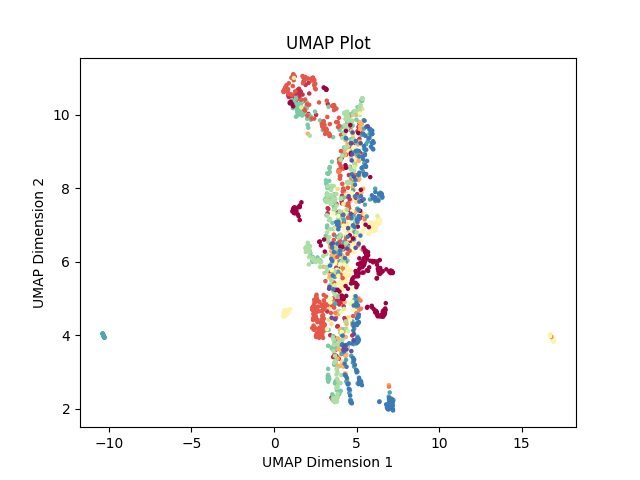

# IBD

## Intro
The goal of this project if to figure out Inflammatory Bowel Diseases (IBD).
I do realize that the problem is very complex and requires several breakthroughs in immunology, microbiology, drug design, diagnostics, and probably many other fields.
But I still can't wrap my head around the fact that currently patients are treated with a trial-and-error approach.
That's why, we're starting with the problem of drug response prediction.

## Current status
So far, I've found ~2500 samples of expression data from mucosal biopsies of IBD patients, spanning across 32 datasets and 13 different platforms (see [Datsets](#datasets)).
All of the datasets collected so far are from the Gene Expression Omnibus (GEO).
To analyze this data together, I've implemented a data processing pipeline for 3 platforms and several datasets, allowing me to play around with ~1k samples.
The expressions are 
I have also implemented a comprehensive modeling pipeline in the ```ibd/notebooks/experiment_playground.ipynb``` notebook.
The output model predicts Infliximab response in patients with CD and UC with 0.78 cross-validation AUC.
It identified 5 most importang genes: DCBLD1, IL13RA2, CSGALNACT2, WNK2, SNAPC1.
Some of those don't seem to make any sense, but some really, really do (e.g., IL13RA2 and WNK2).
Furthermore, the correlation analysis shows that most of these genes actually don't have any other genes correlated above 0.8, with the exception of CSGALNACT2.
This gene in and of itself doesn't seem to make sense at all, but it's correlated with a bunch of other genes that do: IL1R1, FGF7, LY96, MMP19.

I checked how the model performs on healthy controls, and it indicates that the vast majority of them are predicted to be responders.
This made me think if drug response prediction is the same as predicting if a person should receive a treatment or not, and I have to say, I'm not so sure anymore.
Of course it is also very plausible that the model is simply wrong.
For example, it doesn't consider the severity of the disease, so maybe it simply reflects it (which probably is a good predictor of response to any treatment).
I also implemented a diagnostic model (0.88 CV AUC) to see if maybe some of the genes will be shared with the response model, but I didn't find any.

Semi-supervised learning with additional 450 samples without response doesn't improve the performance at all, but it is probably due to poor normalization, because we're adding many new datasets.
That's why I think it's time to stop playing around with the model, taking a few steps back, and improving the previous steps of the pipeline.

## Datasets

Accession number|Platform|No samples|Disease|Treatment|Processed
-|-|-|-|-|-
GSE179285|GPL6480|254|CD, UC, control||Yes
GSE11223|GPL1708|202|UC, control||Yes
GSE75214|GPL6244|194|CD, UC, control||Yes
GSE92415|GPL13158|183|UC, control||Yes
GSE73661|GPL6244|178|UC|Infliximab, Vedolizumab|Yes
GSE48634|GPL10558|171|CD, UC, control||Yes
GSE87473|GPL13158|127|UC, control||Combination of GSE87465 and GSE87466
GSE3629|GPL570|121|UC, colorectal cancer||Yes
GSE59071|GPL6244|116|CD, UC||Subset of GSE75214
GSE23597|GPL570|113|UC|Infliximab, Vedolizumab|Yes
GSE87466|GPL13158|108|UC, control||Yes
GSE16879|GPL570|73|CD, UC, control|Infliximab|Yes
GSE10616|GPL5760|58|CD, UC, control||
GSE13367|GPL570|56|UC, control||
GSE38713|GPL570|43|UC||
GSE96665|GPL13607|41|CD, UC||
GSE53306|GPL14951|40|UC, control||
GSE52746|GPL17996|39|CD, control|Infliximab|Yes
GSE114527|GPL14951|38|UC||
GSE6731|GPL8300|36|CD, UC||
GSE36807|GPL570|35|CD, UC, control||Yes
GSE9686|GPL5760|33|CD, UC, control||
GSE14580|GPL570|30|UC|Infliximab|Subset of GSE16879
GSE22619|GPL570|30|UC||Yes
GSE74265|GPL570|30|UC||
GSE9452|GPL570|26|UC||Yes
GSE12251|GPL570|23|UC|Infliximab|Subset of GSE23597
GSE87465|GPL13158|19|UC, control||Yes
GSE1152|GPL96|12|CD, UC, control||
GSE72780|GPL570|9|CD||Yes
GSE111761|GPL13497|6|CD|anti-TNF|
GSE1141|GPL96|6|CD||
GSE1142|GPL97|6|CD||Duplicate of GSE1141

The visualization below illustrates the samples processed so far after batch normalization.
The color represents the dataset.


There's something weird going on with the samples from GSE48634, so I've excluded them from the plot.
It seems as though they are composed of 2 separate datasets, one with the majority of samples very similar to all other, and the other with only a handful of samples, but completely different from the rest.

## Roadmap

### Next steps
- More work on normalization!!!
- Extracting biopsy location and inflammation status from metadata
- Adding next platforms to gain access to more data
- Going back and improving the whole pipeline
- Metadata processing as generic code + configs instead of classes
- Include sample controls
- Adding an actual database
- Collecting more data

### [Further On Up The Road](https://www.youtube.com/watch?v=h5aVK70P88k)
- Processing raw microarray data instead of processed expressions
- Productization: dockerization, orchestration, automation, cloud processing, ...
- Automating the process of building predictive models
- Foundation model for gene expression
- Application for non-coding users

## Setup
After downloading the repo, first install the dependencies.
```
pip install -r requirements
```

Then, you can install the package (```pip install .```), or run it directly from the repo.
The package is runnable and currently serves one main purpose - to download and process the data.
You can run it like this:
```
python -m ibd run-pipeline -d GSE11223,GSE75214,GSE6731
```
This will download the data from the 3 datasets, process it, and save the results in the ```db``` directory.

You can also run the pipeline for all datasets in the database (currently in ```data/DAQ.csv``` file) by omitting the ```-d``` flag.
```
python -m ibd run-pipeline
`````

In order for it to work, there needs to be:
- a class to process the expression data for a given platform (currently supported platforms are: ```GPL1708```, ```GPL6244```, ```GPL570```, and ```GPL17996```),
- a class to process the metadata, which is unfortunately dataset specific.

The package also contains a mock for runnig an experiment, but that's for later.
For now, I'll conduct all of the experiments in notebooks, and go back to this only after improving the whole data processing pipeline, which is a loooong way to go.
