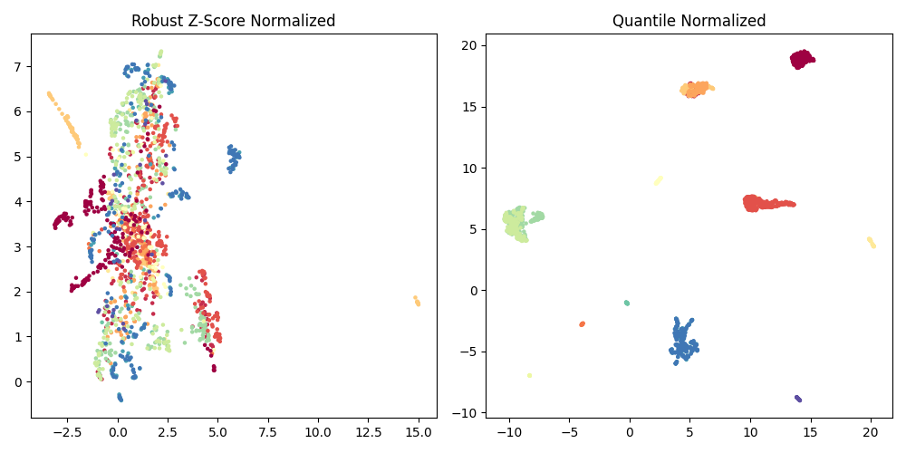
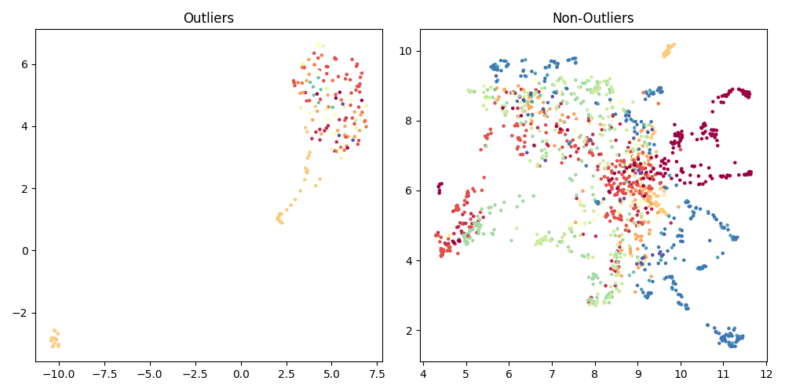

# IBD

## Table of contents
- [Intro](#intro)
- [Current status](#current-status)
    - [Side quest: the hydrogen peroxide hypothesis of UC](#side-quest-the-hydrogen-peroxide-hypothesis-of-uc)
- [Datasets](#datasets)
- [Roadmap](#roadmap)
- [Setup](#setup)

## Intro
The goal of this project if to figure out Inflammatory Bowel Diseases (IBD).
I do realize that the problem is very complex and requires several breakthroughs in immunology, microbiology, drug design, diagnostics, and probably many other fields.
But I still can't wrap my head around the fact that currently patients are treated with a trial-and-error approach.
That's why, we're starting with the problem of drug response prediction.

## Current status
So far, I've found ~2500 samples of expression data from mucosal biopsies of IBD patients, spanning across 32 datasets and 13 different platforms (see [Datsets](#datasets)).
All of the datasets collected so far are from the Gene Expression Omnibus (GEO).
To analyze this data together, I've implemented a data processing pipeline for 3 platforms and several datasets, allowing me to play around with ~1k samples.
The expressions are 
I have also implemented a comprehensive modeling pipeline in the ```ibd/notebooks/experiment_playground.ipynb``` notebook.
The output model predicts Infliximab response in patients with CD and UC with 0.78 cross-validation AUC.
It identified 5 most importang genes: DCBLD1, IL13RA2, CSGALNACT2, WNK2, SNAPC1.
Some of those don't seem to make any sense, but some really, really do (e.g., IL13RA2 and WNK2).
Furthermore, the correlation analysis shows that most of these genes actually don't have any other genes correlated above 0.8, with the exception of CSGALNACT2.
This gene in and of itself doesn't seem to make sense at all, but it's correlated with a bunch of other genes that do: IL1R1, FGF7, LY96, MMP19.

I checked how the model performs on healthy controls, and it indicates that the vast majority of them are predicted to be responders.
This made me think if drug response prediction is the same as predicting if a person should receive a treatment or not, and I have to say, I'm not so sure anymore.
Of course it is also very plausible that the model is simply wrong.
For example, it doesn't consider the severity of the disease, so maybe it simply reflects it (which probably is a good predictor of response to any treatment).
I also implemented a diagnostic model (0.88 CV AUC) to see if maybe some of the genes will be shared with the response model, but I didn't find any.

Semi-supervised learning with additional 450 samples without response doesn't improve the performance at all, but it is probably due to poor normalization, because we're adding many new datasets.
That's why I think it's time to stop playing around with the model, taking a few steps back, and improving the previous steps of the pipeline.

### Side quest: the hydrogen peroxide hypothesis of UC
More recently, I've been on a side quest, exploring the hydrogen peroxide hypothesis of UC.
In a nutshell, the idea is that UC is caused by oxidative stress, which leads to too much hydrogen peroxide in the colon.
This leads to the degradation of the tight junctions of the epithelium, which allows the bacteria to enter the lamina propria, and the neutrophils to enter the lumen.
Moreover, the hydrogen peroxide acts as a chemoattractant for the neutrophils, so it recruits even more of them.
This starts a vicious cycle, as the neutrophils produce more hydrogen peroxide, which attracts even more neutrophils...
Moreover, the excess of hydrogen peroxide (which is cell-membrane permeable) can enter the epithelial cells and cause damage to the mitochondrial DNA, which disrupts the electron transport chain, and leads to even more ROS.
This is a very interesting hypothesis, and I'm currently trying to find a way to test it using the data I have.
My first idea is to look for genes that are involved in redox reactions, and see if they are differentially expressed in UC patients.

Wow, wow, wow, wow!!!
The results are in and it is crystal clear that Mitochondrial Fatty Acid Oxidation is concistently downregulated in UC patients!
Some combinations of the following genes are significantly downregulated in UC patients across all datasets.
They appear 53 times across all differentially expressed genes in UC patients and are always downregulated!
ALWAYS!
These genes are involved in the following processes:
- ACSF2 is involved in the activation of fatty acids,
- CPT1A is involved in the transport of acylcarnitines from the cytoplasm through the outer mitochondrial membrane,
- CPT2 is involved in the transport of acylcarnitines from the intermembrane space through the inner mitochondrial membrane to the mitochondrial matrix,
- ECI1 is involved in the beta-oxidation of unsaturated fatty acids (?),
- HADHA and HADHB are involved in the beta-oxidation of long-chain fatty acids,
- ACADM is involved in the beta-oxidation of medium-chain fatty acids,
- HADH is involved in the beta-oxidation of short-chain fatty acids,
- SCP2 is involved in the transport of fatty acids from the cytoplasm to the peroxisome (?),
- SLC22A5 encodes OCT2, involved in the transport of carnitine into the cell,
- SLC25A20 encodes CACT - carnitine-acylcarnitine translocase.

Ok - evidence only keeps piling up despite my best efforts to disprove it.
There's still one weird dataset (GSE48634) which yields only 6, totally random differentially expressed genes, despite being currently the largest dataset.
However, after deeper inspection, some of the samples actually come from the ileum, not the colon.
I'll deal with it later.

After expanding the analysis to all differentially expressed genes (not just the arbitrary top 500), I've also found that there are actually 71 total appearances of the above genes in the differentially expressed genes in UC patients, however, 6 of them are upregulated.
When I looked at these overexpressed genes, I've found that they are all consistently overexpressed across all datasets and they come from the same family: ACSL1, ACSL3, and ACSL4.
I don't know what that means yet, but it's definitely interesting!

Given all of the above, I'm starting to have less and less doubt that the mitochondrial fatty acid oxidation is altered in UC patients.
How exactly?
Why?
What does it mean?
How can we use it?
I don't know, but I'm going to find out.

## Datasets

Accession number|Platform|No samples|Disease|Treatment|Processed
-|-|-|-|-|-
GSE179285|GPL6480|254|CD, UC, control||Yes
GSE11223|GPL1708|202|UC, control||Yes
GSE75214|GPL6244|194|CD, UC, control||Yes
GSE92415|GPL13158|183|UC, control||Yes
GSE73661|GPL6244|178|UC|Infliximab, Vedolizumab|Yes
GSE48634|GPL10558|171|CD, UC, control||Yes
GSE87473|GPL13158|127|UC, control||Combination of GSE87465 and GSE87466
GSE3629|GPL570|121|UC, colorectal cancer||Yes
GSE59071|GPL6244|116|CD, UC||Subset of GSE75214
GSE23597|GPL570|113|UC|Infliximab, Vedolizumab|Yes
GSE87466|GPL13158|108|UC, control||Subset of GSE92415
GSE16879|GPL570|73|CD, UC, control|Infliximab|Yes
GSE10616|GPL5760|58|CD, UC, control||
GSE13367|GPL570|56|UC, control||
GSE38713|GPL570|43|UC||
GSE96665|GPL13607|41|CD, UC||
GSE53306|GPL14951|40|UC, control||
GSE52746|GPL17996|39|CD, control|Infliximab|Yes
GSE114527|GPL14951|38|UC||
GSE6731|GPL8300|36|CD, UC||
GSE36807|GPL570|35|CD, UC, control||Yes
GSE9686|GPL5760|33|CD, UC, control||
GSE14580|GPL570|30|UC|Infliximab|Subset of GSE16879
GSE22619|GPL570|30|UC||Yes
GSE74265|GPL570|30|UC||
GSE9452|GPL570|26|UC||Yes
GSE12251|GPL570|23|UC|Infliximab|Subset of GSE23597
GSE87465|GPL13158|19|UC, control||Yes
GSE1152|GPL96|12|CD, UC, control||
GSE72780|GPL570|9|CD||Yes
GSE111761|GPL13497|6|CD|anti-TNF|
GSE1141|GPL96|6|CD||
GSE1142|GPL97|6|CD||Duplicate of GSE1141

The visualization below illustrates the samples processed so far after two types of normalization (quantile and z-score).
The color represents the dataset.



Clearly, quantile normalization doesn't work here.
The robust Z-score normalization seems to work better, but there are still a couple of samples that are very different from the rest.
There's also something weird going on with the samples from GSE48634, so I've excluded them from the plot.
It seems as though this dataset is composed of 2 separate datasets, one with the majority of samples very similar to all other, and the other with only a handful of samples, but completely different from the rest, but I've looked at the metadata and it doesn't seem to be the case.

Performing outlier detection seems to do the trick.
Here's the same plot, but with outliers removed.



I just found the [ARCHS4 database](https://maayanlab.cloud/archs4/index.html), which contains over 130k samples of human gene expression, all uniformly processed!

## Roadmap

### Side quest
- The hydrogen peroxide hypothesis of UC

### Next steps
- More work on normalization!!!
- Going back and improving the whole pipeline
- Metadata processing as generic code + configs instead of classes
- Include sample controls
- Adding an actual database
- Collecting more data

### [Further On Up The Road](https://www.youtube.com/watch?v=h5aVK70P88k)
- Processing raw microarray data instead of processed expressions
- Extend the platform to RNASeq data
- Productization: dockerization, orchestration, automation, cloud processing, ...
- Automating the process of building predictive models
- Foundation model for gene expression
- Application for non-coding users

## Setup
After downloading the repo, first install the dependencies.
```
pip install -r requirements
```

Then, you can install the package (```pip install .```), or run it directly from the repo.
The package is runnable and currently serves one main purpose - to download and process the data.
You can run it like this:
```
python -m ibd run-pipeline -d GSE11223,GSE75214,GSE6731
```
This will download the data from the 3 datasets, process it, and save the results in the ```db``` directory.

You can also run the pipeline for all datasets in the database (currently in ```data/DAQ.csv``` file) by omitting the ```-d``` flag.
```
python -m ibd run-pipeline
`````

In order for it to work, there needs to be:
- a class to process the expression data for a given platform (currently supported platforms are: ```GPL1708```, ```GPL6244```, ```GPL570```, and ```GPL17996```),
- a class to process the metadata, which is unfortunately dataset specific.

The package also contains a mock for runnig an experiment, but that's for later.
For now, I'll conduct all of the experiments in notebooks, and go back to this only after improving the whole data processing pipeline, which is a loooong way to go.
